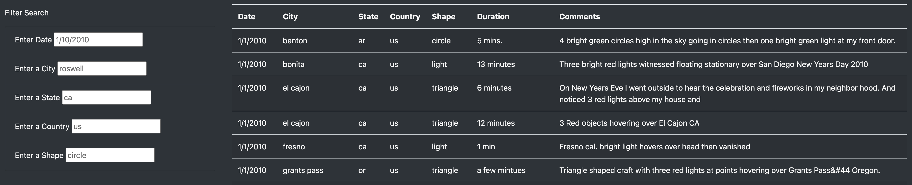
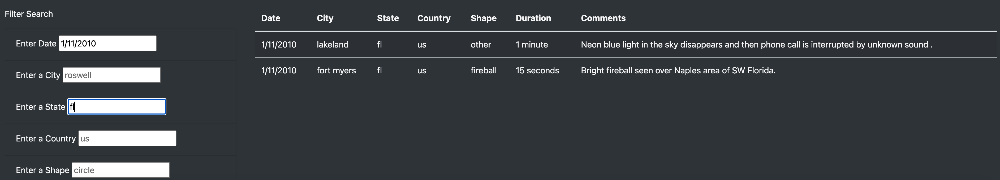

# UFOs
Module 12 - UFO Webpage
 Necessary index.html file is located at the same level as this ReadMe.

## Overview
The goal of this project was to provide a way for the public to view a list of recorded UFO sightings and events.  But more importantly, we wanted to provide any visitor to the website the ability to easily search for results (datetime, city, etc...).  This way someone could both find a specific event, perhaps if they were interested in their own area, or someone could search on general criteria.  The latter would probably have more impact since we could answer questions like what state has the largest number of sightings or what shape has the least number of sightings.

## Results
To create this webpage and its functionality we are using Javascript along with HTML.  The HTML code allows us to build the base of our webpage, and the Javascript allows us to populate the page with our data, stored as a separate JS file.  Using the D3 library from Javascript we first populate our table by adding rows and data to the table element of our HTML page.  The result of this portion of code can be seen below when the table is Unfiltered.

Then we initiated an "Event Listener" using the code "d3.selectAll("input").on("change", updateFilters);" in our Javascript to watch the input box elements and run specific code when a "change" event occurs.  The change event takes place whenever someone has brought focus to an input box and then the actual event occurs when the focus moves somewhere else.  This is done by clicking away from the input box or hitting return for example.  From here, our code kicks off a function that takes in all filters currently filled and iterates over our table data so that only rows with data matching any/all filters are seen.  An example of this can be seen below where the data has been filtered to only include data from the date 1/11/2010 and the state Florida (fl).

## Summary
Finally, some limitations and further development should be discussed for this webpage.  I believe the primary shortcoming is that we can only select one option per filter.  If for example someone wanted to look at a daterange instead of a specific date, the webpage wouldn't be capable.  Some additional changes that would be beneficial include using dropdown lists or limited lists for values that can be used in some of the filters.  This would prevent someone from using a State value that doesn't exist, and would provide someone with an easy way to see what values are available.  Second would be to add sorting capabilities since someone may want to filter on a date but then sort by State to see which of the states has the most sightings on that day.  Third would be adding some rollover information, at least for the column "Shape".  This column name seems a bit confusing to me since some of its values are "unknown" or "light".  Adding capability so that when you hover on that column we get some info about the column might prevent some of the confusion.  Finally allowing a filter for duration, although this might require us to transform the data in that column to be more numeric or datetime friendly.
